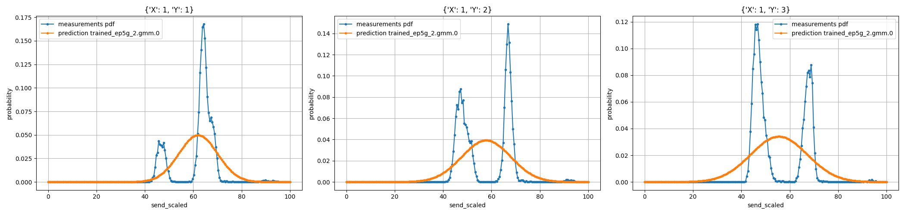
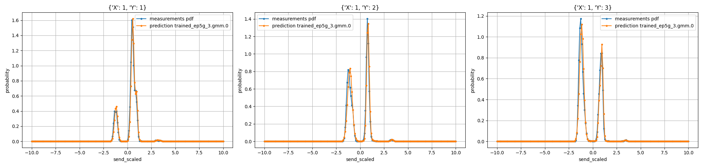

# Training Notes

Fitting the Gaussian mixture model to the delay distribution of a time-slotted wireless network needs care.

1. Altough delay is a positive number, for GMM to fit properly and not underfit, it is better to move it around the axis center. This is known as standardization in machine learning.
2. Delay values must be scaled. They are calcualted from the kernel timestamps that are in nanoseconds scale. They need to be flout64 and in miliseconds scale.

In python, using `pyspark`, scale and standardize the uplink delay
```python 
from pyspark.sql.functions import col, mean

target_mean = df.select(mean('send')).collect()[0][0]
df = df.withColumn('send_scaled', ((col('send')-target_mean) * 1e-6))
```

If we don't move the delay values around zero, the Gaussians do not fit to the spikes. Usually only one Gaussian center remains and covers all three or more spikes as shown below:



After standardization:

